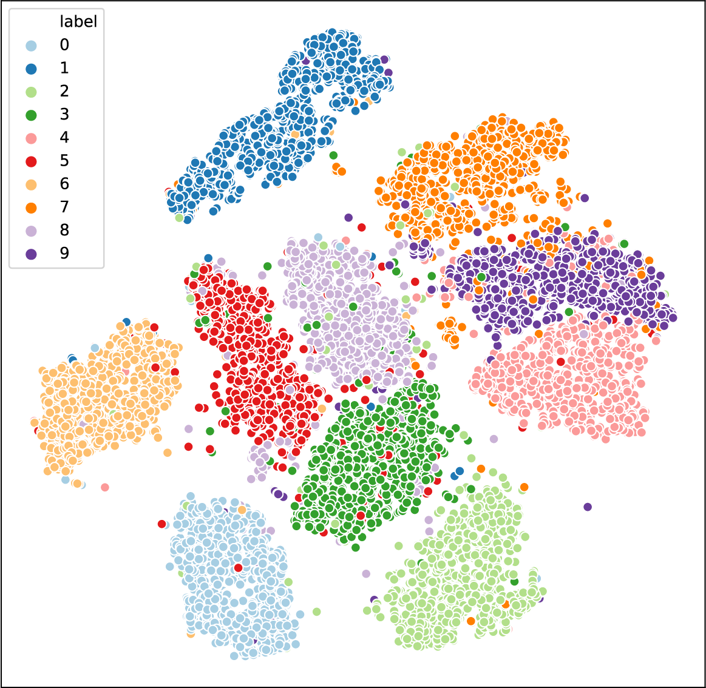
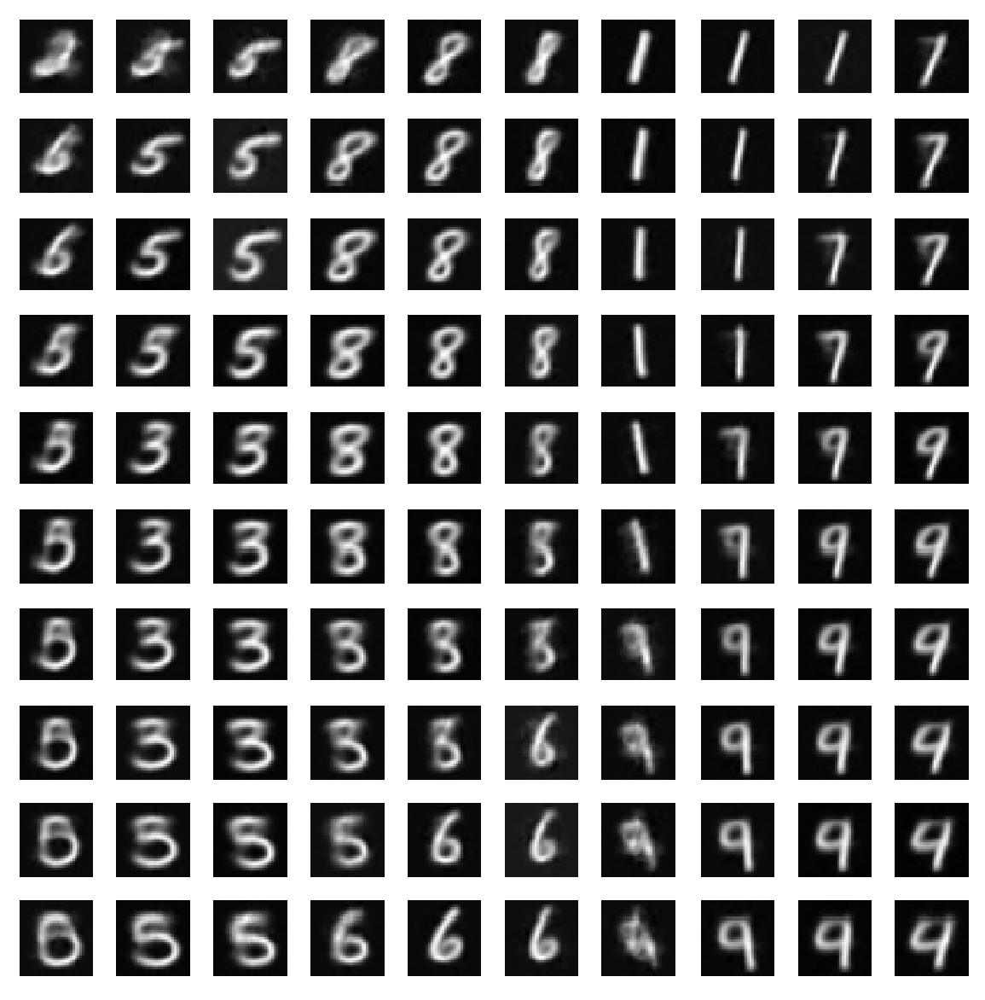
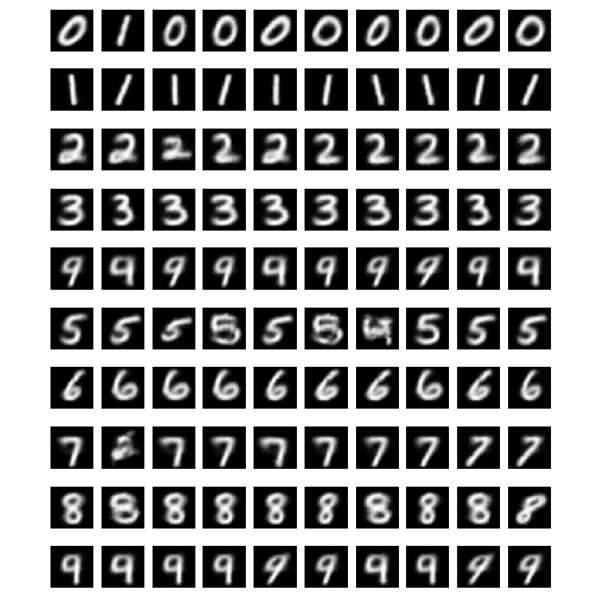

# Autoencoders safari

Convolutional Autoencoders implementations using tensorflow and keras and the MNIST dataset.

In this safari you will see three implementations of autoencoders: a convolutional autoenconder, a convolutional variational autoencoder and a convolutional conditional variational autoencoder.

## Convolutional Autoencoder (CA)
[convolutional_autoencoder.ipynb](./convolutional_autoencoder.ipynb): implementation of a convolutional autoencoder.

- Both the encoder and the decoder have convolutional layers.
- You will also find some plots of the latent space.

## Convolutional Variational Autoencoder (CVA)
[variational_convolutional_autoencoder.ipynb](./variational_convolutional_autoencoder.ipynb): implementation of a convolutional variational autoencoder.

- We make use of the reparametrization trick.
- Both the encoder and the decoder have convolutional layers.
- You will also find some plots of the latent space.
- At the end you will find how to generate samples using the trained encoder.

## Convolutional Conditional Variational Autoencoder (CCVA)
[conditional_convolutional_variatinoal_autoencoder.ipynb](./conditional_convolutional_variatinoal_autoencoder.ipynb): implementation of a convolutional conditional variational autoencoder.

- We make use of the reparametrization trick.
- Both the encoder and the decoder have convolutional layers.
- At the end you will find how to generate samples using the trained encoder and custom labels to select the category of the samples.

